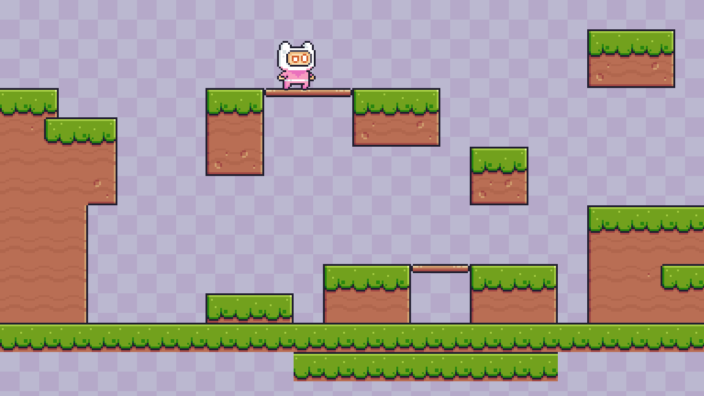

# 🕹️ 2D Platformer Game (My First Game in Godot!)

This is a simple 2D platformer made using the [Godot Engine](https://godotengine.org/).  
It features basic player movement, jumping, gravity, and sprite flipping.

I built this game by following this beginner-friendly tutorial:  
🎥 Start Your Game Creation Journey Today! (Godot beginner tutorial) by Coco Code (https://youtu.be/5V9f3MT86M8?si=EwXj1TFb-uGbiKWX)

---

## 📸 Screenshot

> A simple platformer with basic mechanics — jump, run, and land smoothly!

---

## ✨ Features
- Player movement with left/right controls
- Jumping with gravity
- Ground detection using `is_on_floor()`
- Sprite flipping (face left/right based on input)
- Clean, readable GDScript structure

---

## 🎮 Built With
- **Godot Engine** v4.x
- GDScript (Python-like scripting language)
- Custom logic based on CharacterBody2D and physics

---

## 🧠 What I Learned
- How to set up a 2D character with physics and movement
- Handling input actions like `ui_left`, `ui_right`, and `ui_accept`
- Using `velocity`, `move_and_slide()`, and `flip_h` for sprite logic
- Basics of the game loop and `_physics_process(delta)`

---

## 🗂️ Folder Structure
